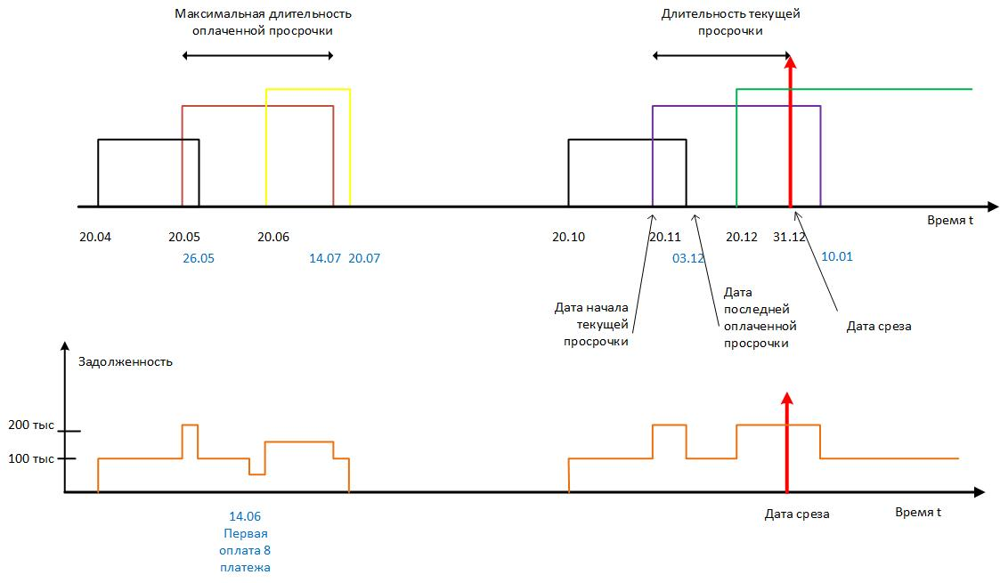

Код служит для расчета следующих показателей просрочки по платежам:

1. Максимальная длительность оплаченной просрочки
2. Дата последней оплаченной просрочки
3. Дата начала текущей просрочки
4. Количество дней просроченных платежей текущей задолженности
5. Количество оплаченных лизинговых платежей
6. Сумма текущей задолженности
7. Максимальные суммы просрочке за 3, 6 и 12 месяцев

В качестве исходных данных берутся 60 помесячных срезов портфеля, хранящихся в БД Oracle. Список таблиц, в которых хранятся срезы хранятся в переменной tables

Период срезов с 2017 по 2021 включительно

Данные по начисленным и оплаченным платежам хранятся в БД Oracle в таблице DM.DM_DETAILS_DAILY. Первичным ключом которой является поле CONTRACT_KEY. По этому полю производится соединение с портфелями

Смысл рассчитанных полей представлен на рис 1.

Исходя из приведенного на рисунке примера на Дату среза 31.12.2021 рассчитанные параметры должны быть:
- Максимальная длительность оплаченной просрочки        55  (14.07-20.05)   
- Дата последней оплаченной просрочки       03.12.2021
- Дата начала текущей просрочки     20.11.2021          
- Количество дней просроченных платежей текущей задолженности   41 (31.12-20.11)   
- Сумма текущей просрочки на дату среза     200 000,00      

Максимальные суммы просрочки за 3, 6 и 12 месяцев рассчитываются как просрочки на конец каждого месяца, предшествующие или совпадающие дате среза и далее из этих сумм берется максимум (за 3, 6 и 12 месяцев). 
